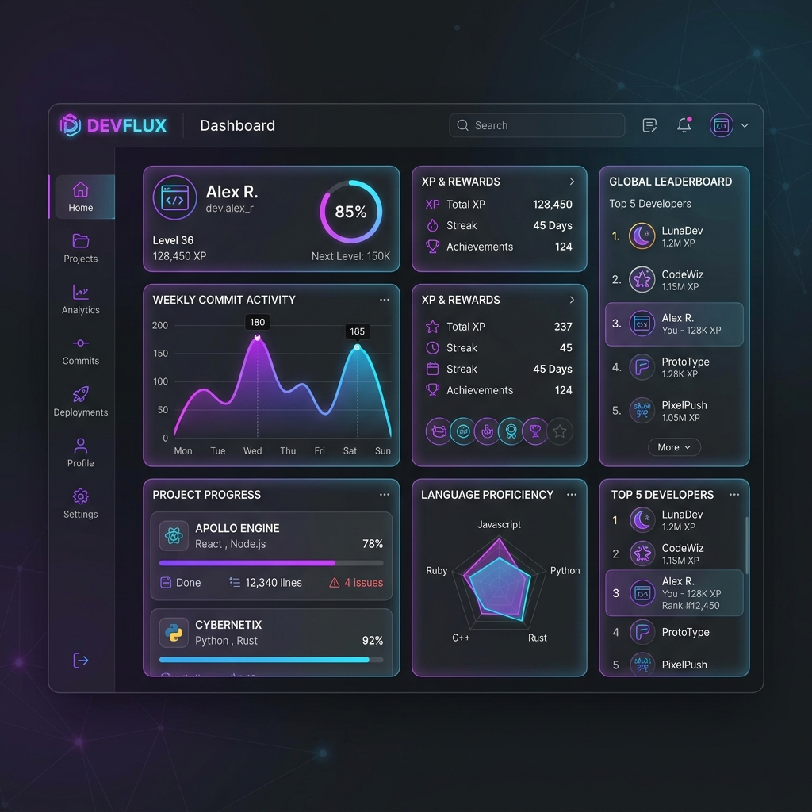
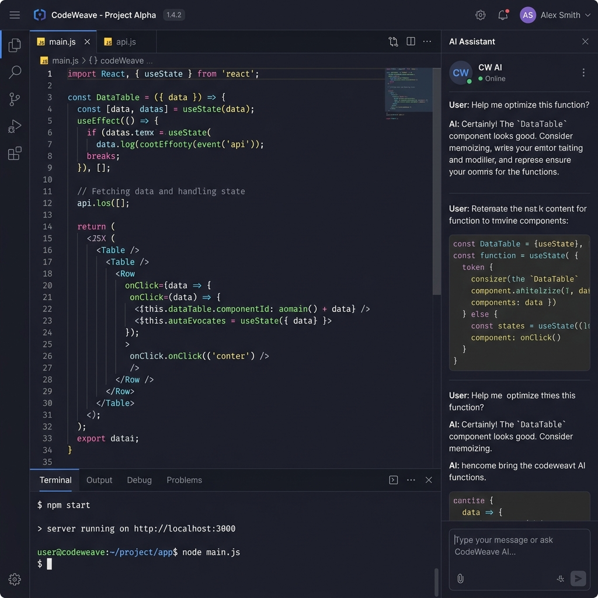
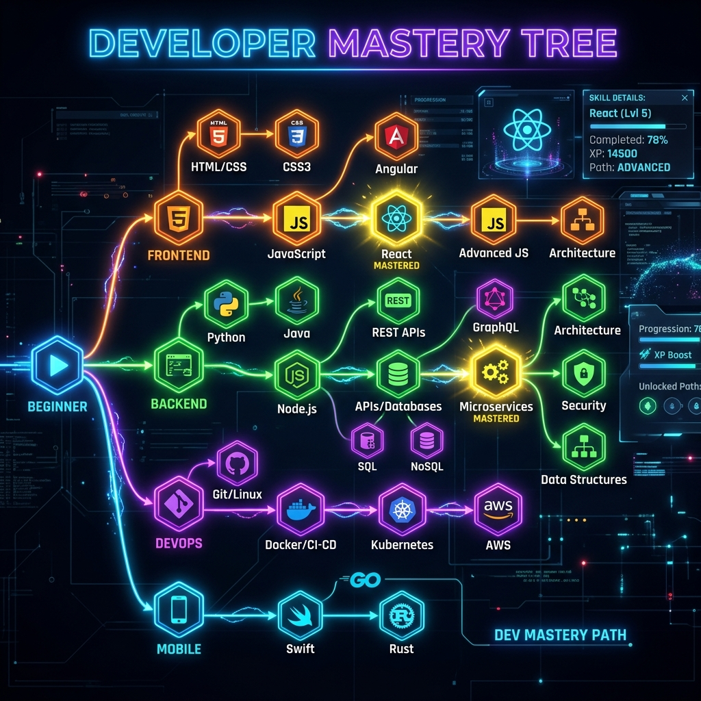

<div align="center">

  <h1>🚀 DEVARENA</h1>
  <p><strong>The Next-Generation Gamified Developer Platform</strong></p>

  <p>
    <a href="#features"></a>
    <a href="#tech-stack"></a>
    <a href="#getting-started"></a>
    <a href="https://github.com/harshadbhaigohil40-oss/devarena-/blob/main/LICENSE"></a>
  </p>

  <p>
    <em>A high-performance web application designed for developer interviews, competitive programming, and technical assessments. Elevate your coding skills with interactive IDEs, AI-assisted feedback, and gamified progress tracking.</em>
  </p>

</div>

---

## 📑 Table of Contents

- [Overview](#-overview)
- [Key Features](#-key-features)
- [Technology Stack](#-technology-stack)
- [System Architecture](#-system-architecture)
- [Getting Started](#-getting-started)
- [Project Structure](#-project-structure)
- [Security](#-security)
- [Contributing](#-contributing)
- [License](#-license)

---

## 🌟 Overview

**DEVARENA** bridges the gap between learning and performing. Whether you are preparing for technical interviews, exploring data structures and algorithms, or building system designs, this platform provides a **hardened, secure, and intuitive environment** to test your knowledge against real-world parameters.

It is equipped with the **Gemini 2.5 Flash AI**, meaning every code submission, bug, and query receives instant, expert-level code review and career mentorship.

### 📸 Application Previews

<p align="center">
  
  <br>
  <em>Modern Gamified Dashboard & Leaderboard</em>
</p>

<p align="center">
  
  <br>
  <em>Interactive IDE with Gemini AI Code Assistant</em>
</p>

<p align="center">
  
  <br>
  <em>Interactive Node-Based Skill Tree</em>
</p>

---

## ✨ Key Features

| Feature | Description |
| :--- | :--- |
| 🧑‍💻 **Interactive Code Editor** | High-performance editor powered by Monaco (VS Code core) featuring deep syntax highlighting, auto-completion, and live error detection. |
| 🛡️ **Secure Sandboxing** | Isolated server-side execution environment for JavaScript and Python to securely evaluate logic without server compromise. |
| 🌳 **Dynamic Skill Trees** | Visualize your growth! An interactive node-based roadmap to guide you from basic arrays to advanced system design. |
| 🤖 **AI Career Advisor** | Powered by Google's latest **Gemini 2.5 Flash AI**. Get instant mentorship, actionable feedback, and automated resume ATS scoring. |
| 🎮 **Gamification Engine** | Earn XP, unlock badges, and level up. Compete on global leaderboards and showcase your streak. |
| ⚡ **Extreme Performance** | Leveraging route caching, database indexing, and aggressive Vite chunk splitting for lightning-fast page loads. |

---

## 🛠 Technology Stack

### Frontend Architecture
- **Core:** React 18, Vite
- **State Management:** Zustand, React Query
- **Styling & UI:** Tailwind CSS, Custom Design System, Framer Motion (Animations)
- **Data Visualization:** Recharts
- **Real-Time Communication:** Socket.io-client

### Backend Infrastructure
- **Runtime:** Node.js, Express.js
- **Database:** MongoDB (with Mongoose ORM)
- **Caching & Performance:** Node-Cache, Compression
- **Security:** Helmet, Express-Mongo-Sanitize, Rate Limiting
- **Authentication:** JSON Web Tokens (JWT), Google OAuth2
- **AI Integration:** Google Generative AI (`gemini-2.5-flash`)

---

## 🏗 System Architecture

The project follows a decoupled **Client-Server Architecture**:

1. **Client Layer:** A Single Page Application (SPA) built with React. Handles UI rendering, local state, and Monaco IDE.
2. **API Gateway & Routing:** Express.js handles REST API endpoints, JWT validation, and Socket.io events.
3. **Execution Engine:** Submissions are routed to isolated environments. JavaScript is evaluated in a restricted `vm` context, and Python uses hardened sub-processes.
4. **Data Layer:** MongoDB stores user profiles, challenges, submissions, and leaderboards.

---

## 🚀 Getting Started

Follow these instructions to set up the project locally for development and testing.

### Prerequisites

Ensure you have the following installed on your local machine:
- **Node.js** (v18.x or higher)
- **MongoDB** (Local instance or Atlas URI)
- **Python** (v3.9 or higher for Python execution support)
- **Git**

### Installation Steps

**1. Clone the repository:**
```bash
git clone https://github.com/harshadbhaigohil40-oss/devarena-.git
cd devarena
```

**2. Install Dependencies:**
We use a workspace approach. Run the following from the root directory to install both client and server dependencies:
```bash
npm install
```

**3. Configure Environment Variables:**
Copy the `.env.example` file and configure your local keys.
```bash
cp .env.example .env
```
Ensure you provide valid values for:
- `MONGODB_URI`
- `JWT_SECRET`
- `GEMINI_API_KEY`

**4. Start the Application:**
We use `concurrently` to spin up both servers with one command:
```bash
npm run dev
```

- 🌐 **Frontend:** runs on `http://localhost:5173`
- ⚙️ **Backend:** runs on `http://localhost:5000`

---

## 📂 Project Structure

```text
DEVARENA/
├── client/                 # React Frontend Application
│   ├── src/
│   │   ├── components/     # Reusable UI components
│   │   ├── features/       # Feature-specific modules (IDE, AI, Leaderboard)
│   │   ├── pages/          # Top-level route components
│   │   ├── store/          # Zustand global state
│   │   └── services/       # API integration layers
│   └── vite.config.js
├── server/                 # Express Backend API
│   ├── config/             # DB and Third-party configurations (Gemini, etc.)
│   ├── controllers/        # Business logic for endpoints
│   ├── middleware/         # Auth, Rate Limiting, Error Handling
│   ├── models/             # Mongoose DB Schemas
│   ├── routes/             # Express Router definitions
│   ├── scripts/            # Database seeders and maintenance tools
│   └── server.js           # Entry point
├── shared/                 # Shared logic between Client and Server
└── package.json            # Root workspace configuration
```

---

## 🛡 Security Guidelines

Security is at the heart of DEVARENA. We implement:
- **Code Execution Sandboxing:** Strict environment restrictions to prevent malicious code execution.
- **Data Sanitization:** Complete prevention of NoSQL Injection using `express-mongo-sanitize`.
- **DDoS Mitigation:** Global IP rate limiting across all critical API routes.
- **XSS Protection:** Enforced through Helmet headers and React's built-in escaping.

---

## 🤝 Contributing

We welcome contributions to make DEVARENA even better! 
1. Fork the Project
2. Create your Feature Branch (`git checkout -b feature/AmazingFeature`)
3. Commit your Changes (`git commit -m 'Add some AmazingFeature'`)
4. Push to the Branch (`git push origin feature/AmazingFeature`)
5. Open a Pull Request

---

<div align="center">
  <p>Built with ❤️ for the Developer Community.</p>
</div>
